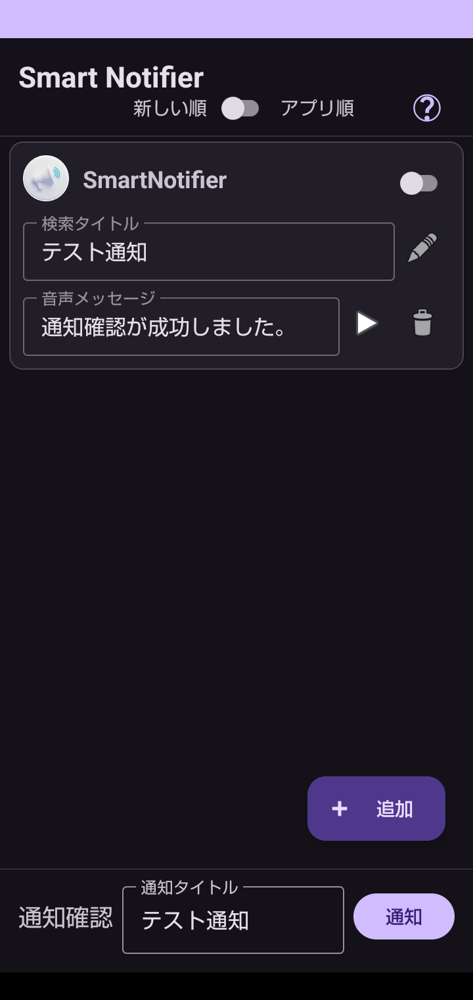
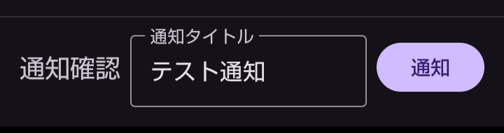
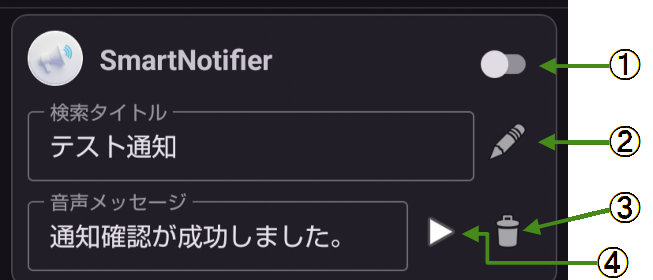
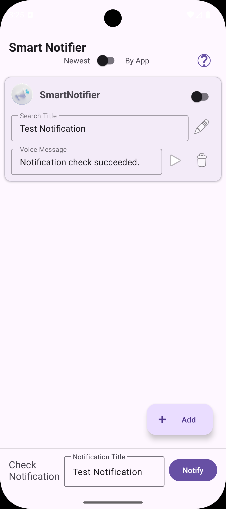
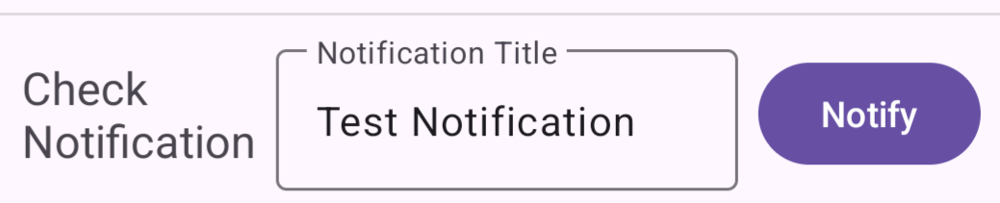
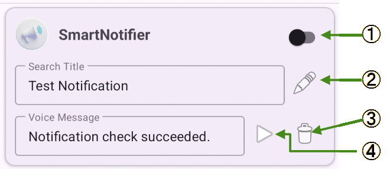

# 📣 Smart Notifire Rev2

## 🧠 このアプリについて

スマートフォンの多くのアプリは「通知音」で通知を知らせます。しかし通知音だけでは、**どのアプリから・どんな内容の通知なのか**は分かりにくいことがほとんどです。

**Smart Notifire** は、

* アプリ名
* 通知タイトルの一部

といったユーザーが指定した条件に一致した通知が届いたとき、 **あらかじめ登録した文章を音声で読み上げる**アプリです。

画面を見なくても、通知の概要を耳で把握できる。それがこのアプリの目的です。

---

## 🧩 動作の仕組み

1. アプリ起動後、通知をモニタし、必要最小限の情報だけをアプリ内に記録します。
2. 記録された通知をもとに、ユーザーは「音声案内ルール」を作成できます。
3. 通知がルールに一致した場合、**通知音の約3秒後**に音声案内を行います。

通知音と音声が重ならないため、落ち着いて内容を把握できます。

---

## ⚠️ 通知の取り扱いについて

通知には、個人情報や機密情報が含まれる場合があります。 そのため **Smart Notifire** では、次の方針を厳守しています。

### 📁 保存する通知情報

保存するのは、通知を識別するための最小限の情報のみです。

* アプリのパッケージ名
* 通知チャンネルID
* 通知タイトル

本文やメッセージ内容そのものは保存しません。

### 🚫 取り扱えない通知

Android OS の制限および Google のプライバシーポリシーにより、 すべての通知を扱えるわけではありません。  
※ 現在の仕様では、アプリ名へ変換できない通知は追加されません。  

例：Gmail、Yahoo!系アプリなど。OSバージョンによって異なる場合があります。

### ✔️ 必要な権限

本アプリを利用するには、次の権限が必要です。

1. 通知へのアクセス権限
2. 通知の表示権限

権限が付与されていない場合、機能は動作しません。

---

## 🔤 使い方

### 初期状態  



インストール直後は、**動作確認用の音声案内ルールが1件**登録されています。 このルールを使って、すべての機能を確認できます。

---

### 🔔 通知確認  



画面下部の「通知」ボタンをタップすると、 このアプリ自身がテスト通知を送信します。

* 初回は通知権限の許可画面が表示されます
* 許可後、通知音 → 音声案内の順で再生されます

---

### 🏛️ 音声案内ルール  



通知を音声化するためのルール一覧画面です。

#### 🔑 ルールの有効化 ①

スイッチを ON にすると、そのルールが有効になります。

* アプリ名
* 検索タイトル（部分一致）

が一致した通知に対して、音声案内が行われます。

---

#### 🔎 検索タイトル

通知タイトルに含まれるキーワードを指定します。 部分一致のため、完全一致である必要はありません。

---

#### 🎤 音声メッセージ

読み上げたい文章を入力します。 TTS（端末の音声読み上げ機能）を使用します。

---

#### 📑 ルールのコピー ②

既存ルールをコピーして、新しいルールを作成できます。

* 検索タイトルは重複しないよう、自動で番号が付与されます

---

#### 🗑️ ルールの削除 ③

選択したルールを削除します。 削除前には確認ダイアログが表示されます。

---

#### ▶️ 音声メッセージの再生 ④

登録した音声メッセージを、その場で再生できます。

---

## 🧭 設計書との用語について

本 README では、設計書（SmartNotifire-Rev2.md）と比べて **ユーザーに分かりやすい表現**を優先しています。

* 「通知検出ルール」 → 「音声案内ルール」
* 「NotificationLog」 → 「通知ログ」

といった形で、意味は同じまま言葉を調整しています。

---

## 📂 ディレクトリ構成（抜粋）

```
SmartNotifire-Rev2
├─ app/
│  └─ src/main/java/com/example/smartnotifier
│     ├─ data/        # データ層（Room / DataStore）
│     ├─ core/        # アプリ基盤
│     └─ ui/          # 画面・ViewModel
├─ docs/
│  └─ design/
│     └─ SmartNotifire-Rev2.md
├─ README.md
└─ LICENSE
```

---

## 🪪 ライセンス

本プロジェクトは個人開発アプリ **Smart Notifire Rev2** です。 ライセンスの詳細は、リポジトリ内の `LICENSE` ファイルをご確認ください。

---

---

# 🌍 English Version

## 📣 About This App

Most smartphone apps notify you using sounds.  
However, notification sounds alone do not tell you **which app** or **what kind of notification** it is.

**Smart Notifire** reads out a custom voice message when a notification matches user-defined conditions such as:

- App name
- Part of the notification title

This allows you to understand notifications **without looking at the screen**.

---

## 🧩 How It Works

1. The app monitors notifications and stores only the minimum information required for identification.
2. Based on stored notifications, users can create *voice guidance rules*.
3. When a notification matches a rule, a voice message is spoken **about 3 seconds after** the notification sound.

This timing prevents the voice guidance from overlapping with the notification sound.

---

## ⚠️ Notification Handling Policy

Notifications may contain personal or sensitive information.  
For this reason, **Smart Notifire** follows strict handling rules.

### 📁 Stored Notification Information

Only the following minimum information is stored:

- App package name
- Notification channel ID
- Notification title

Notification message bodies are **never stored**.

### 🚫 Unsupported Notifications

Due to Android OS restrictions and Google privacy policies,  
**not all notifications can be handled**.

⚠️ **In the current implementation, notifications whose app names cannot be resolved are not added to the notification log.**

### ✔️ Required Permissions

The following permissions are required to use this app:

1. Notification access permission
2. Notification display permission

Without these permissions, the app will not function.

---

## 🔤 How to Use

### Initial State



After installation, **one test voice guidance rule** is registered by default.  
You can use this rule to confirm that all features are working correctly.

---

### 🔔 Notification Check



Tap the **Notification** button at the bottom of the screen to send a test notification.

- On first use, a permission request dialog will be shown
- After permission is granted, the notification sound is played, followed by the voice message

---

### 🏛️ Voice Guidance Rules



This screen shows the list of voice guidance rules.  
The numbers below correspond to the numbered markers in the image above.

#### 🔑 Enable Rule ①

Turn the switch ON to activate the rule.

When both of the following match, voice guidance will be triggered:

- App name
- Search title (partial match)

---

#### 📑 Copy Rule ②

Copies the selected rule and creates a new one.

- A number is automatically appended to avoid duplicate search titles

---

#### 🗑️ Delete Rule ③

Deletes the selected rule.

- A confirmation dialog is shown before deletion

---

#### ▶️ Play Voice Message ④

Plays the registered voice message immediately for confirmation.

---

## 🧭 Terminology Notes

> The design document is written in Japanese.  
> Therefore, terminology explanations in this section are intentionally kept simple.

In this README, user-friendly terms are used instead of internal design document terms.

Examples:

- “Notification Detection Rule” → “Voice Guidance Rule”
- “NotificationLog” → “Notification Log”

The meanings remain the same.

---

## 🪪 License

**Smart Notifire Rev2** is a personal development project.  
Please refer to the `LICENSE` file in this repository for details.
