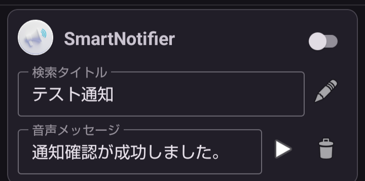

# 📣 Smart Notifire Rev2

## 🧠 このアプリについて

スマートフォンの多くのアプリは「通知音」で通知を知らせます。しかし通知音だけでは、**どのアプリから・どんな内容の通知なのか**は分かりにくいことがほとんどです。

**Smart Notifire** は、

* アプリ名
* 通知タイトルの一部

といったユーザーが指定した条件に一致した通知が届いたとき、 **あらかじめ登録した文章を音声で読み上げる**アプリです。

画面を見なくても、通知の概要を耳で把握できる。それがこのアプリの目的です。

---

## 🧩 動作の仕組み

1. アプリ起動後、通知をモニタし、必要最小限の情報だけをアプリ内に記録します。
2. 記録された通知をもとに、ユーザーは「音声案内ルール」を作成できます。
3. 通知がルールに一致した場合、**通知音の約3秒後**に音声案内を行います。

通知音と音声が重ならないため、落ち着いて内容を把握できます。

---

## ⚠️ 通知の取り扱いについて

通知には、個人情報や機密情報が含まれる場合があります。 そのため **Smart Notifire** では、次の方針を厳守しています。

### 📁 保存する通知情報

保存するのは、通知を識別するための最小限の情報のみです。

* アプリのパッケージ名
* 通知チャンネルID
* 通知タイトル

本文やメッセージ内容そのものは保存しません。

### 🚫 取り扱えない通知

Android OS の制限および Google のプライバシーポリシーにより、 すべての通知を扱えるわけではありません。

例：Gmail、Yahoo!系アプリなど

### ✔️ 必要な権限

本アプリを利用するには、次の権限が必要です。

1. 通知へのアクセス権限
2. 通知の表示権限

権限が付与されていない場合、機能は動作しません。

---

## 🔤 使い方

### 初期状態  


インストール直後は、**動作確認用の音声案内ルールが1件**登録されています。 このルールを使って、すべての機能を確認できます。

（※ 画面イメージはアプリ内ヘルプに表示されます）

---

### 🔔 通知確認  


画面下部の「通知」ボタンをタップすると、 このアプリ自身がテスト通知を送信します。

* 初回は通知権限の許可画面が表示されます
* 許可後、通知音 → 音声案内の順で再生されます

---

### 🏛️ 音声案内ルール  



通知を音声化するためのルール一覧画面です。

#### 🔑 ルールの有効化

スイッチを ON にすると、そのルールが有効になります。

* アプリ名
* 検索タイトル（部分一致）

が一致した通知に対して、音声案内が行われます。

---

#### 🔎 検索タイトル

通知タイトルに含まれるキーワードを指定します。 部分一致のため、完全一致である必要はありません。

---

#### 🎤 音声メッセージ

読み上げたい文章を入力します。 TTS（端末の音声読み上げ機能）を使用します。

---

#### 📑 ルールのコピー

既存ルールをコピーして、新しいルールを作成できます。

* 検索タイトルは重複しないよう、自動で番号が付与されます

---

#### 🗑️ ルールの削除

選択したルールを削除します。 削除前には確認ダイアログが表示されます。

---

#### ▶️ 音声メッセージの再生

登録した音声メッセージを、その場で再生できます。

---

## 🧭 設計書との用語について

本 README では、設計書（SmartNotifire-Rev2.md）と比べて **ユーザーに分かりやすい表現**を優先しています。

* 「通知検出ルール」 → 「音声案内ルール」
* 「NotificationLog」 → 「通知ログ」

といった形で、意味は同じまま言葉を調整しています。

---

## 📂 ディレクトリ構成（抜粋）

```
SmartNotifire-Rev2
├─ app/
│  └─ src/main/java/com/example/smartnotifier
│     ├─ data/        # データ層（Room / DataStore）
│     ├─ core/        # アプリ基盤
│     └─ ui/          # 画面・ViewModel
├─ docs/
│  └─ design/
│     └─ SmartNotifire-Rev2.md
├─ README.md
└─ LICENSE
```

---

## 🪪 ライセンス

本プロジェクトは個人開発アプリ **Smart Notifire Rev2** です。 ライセンスの詳細は、リポジトリ内の `LICENSE` ファイルをご確認ください。

---

# 🌍 English Version

## 📣 About This App

Most smartphone apps notify you using sounds. However, notification sounds alone do not tell you **which app** or **what kind of notification** it is.

**Smart Notifire** reads out a custom voice message when:

* The app name matches
* Part of the notification title matches

This allows you to understand notifications **without looking at the screen**.

---

## 🧩 How It Works

1. The app monitors notifications and stores only minimal identifying information.
2. Users create voice guidance rules based on these notifications.
3. When a notification matches a rule, a voice message is spoken about 3 seconds later.

This avoids overlapping with the default notification sound.

---

## ⚠️ Notification Handling Policy

Notifications may contain sensitive information. Therefore, Smart Notifire follows strict rules.

### 📁 Stored Information

Only the following data is stored:

* App package name
* Notification channel ID
* Notification title

Message bodies are never stored.

### 🚫 Unsupported Notifications

Due to Android OS limitations and Google privacy policies, some notifications cannot be handled (e.g. Gmail).

### ✔️ Required Permissions

* Notification access permission
* Notification display permission

Without these permissions, the app cannot function.

---

## 🪪 License

Smart Notifire Rev2 is a personal development project. Please refer to the `LICENSE` file in the repository for details.
