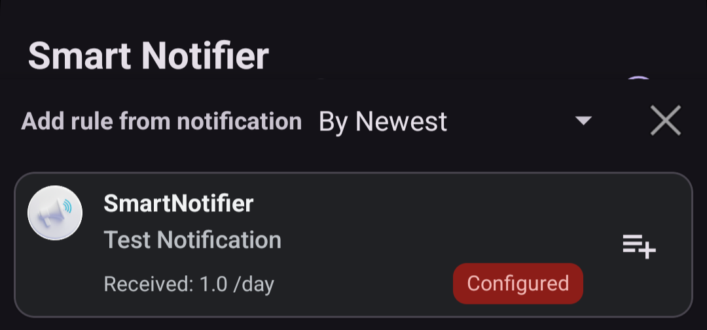

---  
title: Add Rule  
layout: default  
---  
# ✏ Add a Voice Announcement Rule

This app announces received notifications by voice.  
 
## 1⃣ Open the add rule screen

- Tap the add button on the screen.  

## 2⃣ Add a rule

- A list of notifications received so far is displayed.  

  

-  Adds a rule for the selected row.  

## 📌 Display details

- The upper line shows the app name that sent the notification, and the line below it shows the channel name.
- **Received** is the number of notifications per day.
- Configured indicates a notification that already has a voice announcement rule.
- Silent indicates that the notification was a **silent notification** when it was received.
    > A **silent notification** is a notification that does not play a notification sound. This app does not announce silent notifications by voice.  
    > Silent notifications are usually configured by the app, but users can change the setting.  

---

> Next, see [Edit a rule](./edit_rule).  
> [Back to the top page](./index)
