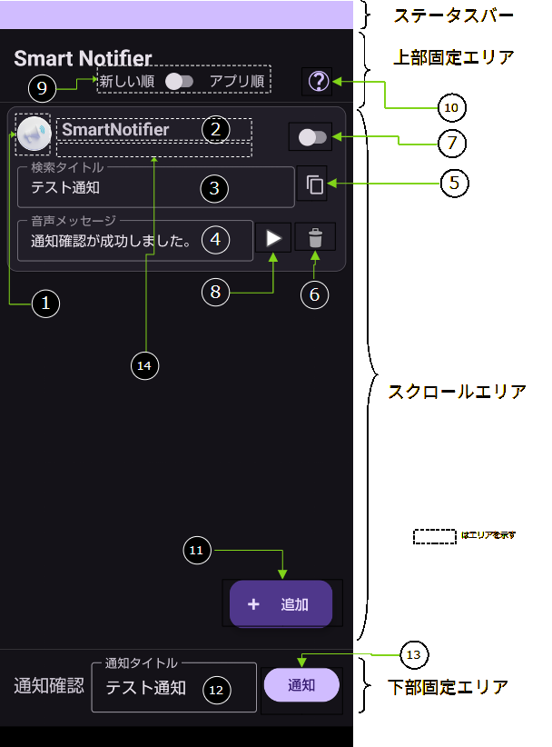

# SmartNotifire-Rev2

Document Rev8 2026-01-29 T.Yoshizawa

## 目的

スマホアプリはプッシュ通知機能（以下、通知と呼称）を持っているものが多い。

通知は通知音設定のデフォルトの通知音が採用されることが多く、通知があっても何の通知か分からないことが多い。従って画面を見る必要があるケースがほとんどである。

本アプリは、ユーザーが決めた条件の通知を音声として副次的に出力することにより、何の通知であるかをわかりやすくすることにある。

## 要件

Androidアプリ通知の受信を音声で副次的にユーザーに知らせる。またユーザが決めた通知タイトルの部分一致によるトリガーでの発声と、ユーザー指定の文字を音声として読み上げること。

## 実装指針

機能追加、変更は常に要件を満たすように整合性を維持する。

### 開発前提条件

- Android StudioをIDEとする
- ソースコード管理はGitを使用する
- GitHubと連携する
- 常に、AndroidフレームワークとGoogle推奨機能を検討し効率化と可読性を重視する構造

### アーキテクチャとデータフロー

- ターゲットAPIレベル
    - ターゲットAPI: API35（Android15）
    - 推奨下限(minSdkVersion) API26（Android8）
- アーキテクチャ

  Android Jetpack の推奨アーキテクチャ（単一 Activity、複数 Fragment）に基づき、**MVVM (Model-View-ViewModel)** パターンを厳格に適用する。

- 責務の明確化
    - **View (Fragment):** データの表示とユーザー入力の収集のみを行い、ロジック（データの取得・加工・保存）は行わない。
    - **ViewModel:** View のライフサイクルを超えてデータを保持し、ビジネスロジックを実行する。
    - **Model (Repository):** データの永続化処理（Room/DataStore）へのアクセスを抽象化コア層
- トップレベルの構成（レイヤーによる責務分離）

    | パッケージ名 | 責務 | 詳細 |
    | --- | --- | --- |
    | data | データソース | データベース (Room)、ネットワークAPI (Retrofit)、`SharedPreferences`などの実装。 |
    | core | アプリ基盤 | アプリのコア機能や共通インフラ。`App Startup`等 |
    | ui | ユーザーインターフェース | View（画面表示）に関するすべて。`Activity`、`Fragment`、`ViewModel`など。 |

- 通知リスナーサービス

  本アプリは NotificationListenerService（通知リスナーサービス：NLS） を機能のメインとする。NLS内処理は競合を避けるべき処理がある場合は同期オブジェクトによる保護、処理直列化を図ること。UIは、設定・状態確認とし、責務を分離するように配慮すること。  
  またNotificationLog(以下、通知ログ)保存には、パッケージ名、PackageManagerからパッケージ名により取得したアプリ名、及びチャンネルIDといった最小限の通知情報のみとする。

- 国際化

  Englishと日本語の2種類に対応する。システムのロケールから日本である場合は日本語でUIを表示するように配慮する。

- TTS(Text-to-Speech)

  テキストの発声はシステムデフォルトのTTSを利用する。TTS変更はユーザーの責務と扱う。

  通知が短時間に同時発生することを考慮して、キュー構造を持った順次処理を考慮する。

  TTSのライフサイクルに沿った処理とし、メモリリークを防ぐように配慮すること。

### エラーハンドリング

- 例外処理

  コルーチン内で発生したDBアクセスエラーやネットワークエラーは、`try-catch` や `Result` ラッパーを用いて捕捉し、View へ表示するための専用の **StateFlow** (例: `_errorMessage: StateFlow<String?>`) を通じて報告する。

### SDK

必要なSDK・ライブラリは作成段階で柔軟に対応する。必要可否はAndroid, Google推奨を優先する。

また、バージョンカタログ(gradle/libs.versions.toml)を使用した統一管理を常に考慮する。

Android Studioでバージョン不整合が原因で発生する警告がでないように配慮する。

### クラス命名規則（ファイル名含む）

| No. | 責務 | 命名規則 |
| --- | --- | --- |
| 1 | View | View名+”Activity” |
| 2 | ViewModel | View名+”ViewModel” |
| 3 | DB関連 | 対象DBがわかること |
| 4 | その他 | 目的・責務がわかること |

### 定数変数

文字列・数値などの定数はタイプミス・メンテナンス性を考慮してなるべく定数変数化(`const`)する。必要であればobject classを作成する。

## Repository

### １．通知検出ルール(Rules)

対象アプリの通知を管理する。

| 項目名    | メンバー名       | 型 | 初期値 | 内容                                                                     |
|--------|-------------| --- | --- |--------------------------|
| ID     | ID          | int | - | 主キー（自動インクリメント） |
| パッケージ名 | PackageName | String | null | 通知を処理するパッケージ名。通知ログの内容から取得。|
| チャンネルID | ChannelID   | String | null | 通知チャンネル。通知ログの内容から取得。 |
| アプリ名   | AppLabel    | String | empty | 可読できるアプリ名。通知ログの内容から取得。 |
| 検索タイトル | SrhTitle    | String | empty | 通知タイトルの検索キーワード。部分一致、empty時は全てヒットとする。UIで更新可能とする。|
| 音声メッセージ | VoiceMsg    | String | empty | 本アプリが検索でヒットした場合に使用するTTSメッセージ。empty時はアプリ名の通知が合ったことをメッセージとする。UIで変更可能とする。 |
| 許可     | Enabled     | bool | False | True: 検索する、 False: 検索しない。 UIで変更可能とする。 |

インデックス　（一意）

| 項目名 | メンバー名 | 順位 |
| --- | --- | --- |
| パッケージ名 | PackageName | 1 |
| チャンネルID | ChannelID | 2 |
| 検索タイトル | SrhTitle | 3 |

### ２．通知ログ(NotificationLog)

通知設定を容易化するために、通知選択画面で使用する。

| 項目名     | メンバー名 | 型 | 初期値   | 内容                                                |
|-----------| -------- | --- |-------|---------------------------------------------------|
| ID      | ID | int | -     | 主キー（自動インクリメント）                                    |
| パッケージ名  | PackageName | String | null | 通知を処理するパッケージ名。通知リスナーサービスから取得する。                   |
| チャンネルID | ChannelID | String | null  | 通知チャンネル。通知リスナーサービスから取得する。                         |
| アプリ名    | AppLabel | String | empty | パッケージ名をPackageManagerにより取得したアプリの名称。(通知モニタ機能で取得する) |
| 受信回数  | ReceivedCount  | Long  | 0  | 通知の受信回数(DB層で自動インクリメントを考慮する)                       |

インデックス　（一意）

| 項目名 | メンバー名 | 順位 |
| --- | --- | --- |
| パッケージ名 | PackageName | 1 |
| チャンネルID | ChannelID | 2 |

### ３．トランザクション

- テーブル操作（追加・更新・削除）については、トランザクションを使用してUiと整合性を保つこと。

## 画面仕様

### １．画面レイアウト

### ２．画面レイアウト項目説明

| No. | 名称 | 識別子 | 型 | 説明及び動作   |
| --- | --- | --- | --- |----------------------|
| ① | アプリアイコン | appIcon | Image | Rules.PackageNameをPackageManager（アプリアイコン）から取得して表示する。但し、オーバーヘッドを考慮し、イメージの保存はメモリキャッシュの利用を考慮する。 |
| ② | アプリ名 | appName | Label | Rules.AppLabelの内容。 |
| ③ | 検索タイトル | srhTitle | TextBox | Rules.SrhTitleの内容。|
| ④ | 音声メッセージ | voiceMsg | TextBox | Rules.VoiceMsgの内容。|
| ⑤ | コピー | copyRow | Icon | タップで選択している行のコピー※を通知検出ルール(Rules)に追加。※一意制約違反になる場合は、末尾に数字形式"-#nn"(nn=01~99)を入れて一意になるようにする。  |
| ⑥ | 削除 | deleteRow | Icon | タップで選択している行を削除する。削除前にユーザーに確認するダイアログを表示する。 |
| ⑦ | 有効 | enabled | SW Box | Rules.Enablesの内容。|
| ⑧ | プレイ | playVoice | Button | Rules.VoiceMsgをTTSで音声出力する。|
| ⑨ | 並び順 | sortList | SW Box | Rules表示の並び順False:Rules.IDの降順Rules:Rules: 1:PackageName, 2:Roules.IDの昇順 |
| ⑩ | ヘルプ | helpIcon | Icon | タップで、アプリのバージョンと簡単な説明を表示。後述のヘルプ表示内容を参照。 |
| ⑪ | 追加 | addRow | Button | 後述のの通知ログリストを表示する。スクロールエリアにあるが、このボタン位置は固定する。通知履歴リスト表示時は隠れるか、通知ログリスト非表示になるまで消す。|
| ⑫ | 通知タイトル | ntfTitle | TextBox | このアプリが通知をするときのタイトル名（デフォルト）テスト通知 |
| ⑬ | 通知 | ntfSend | Button | 通知タイトルで通知する。|

### ３．通知ログリスト

- 画面の追加ボタンで表示するリスト。通知ログ(NotificationLog)のNotificationLog.IDの降順でスクロールエリア全体をリスト表示する。
- 通知ログの１レコードを下図のレイアウトで表示し、表示エリアはスクロールして通知ログ全体を見れるようにする。

| No. | 名称 | 識別子 | 型 | 説明及び動作  |
| --- | --- | --- | --- |-------------|
| ① | アプリアイコン | appIcon | Image | NotificationLog.PackageNameをPackageManager（アプリアイコン）から取得して表示する。但し、オーバーヘッドを考慮し、イメージの保存はメモリキャッシュの利用を考慮する。 |
| ② | アプリ名 | appName | Label | NotificationLog.AppLabelの内容。|
| ③ | 受信回数 | receiveCount | Label | NotificationLog.ReceivedCountの内容。|
- リストは通知ログの全レコードを全て設定せず、表示行＋バッファ（１０行※現時点で仮定義）といった形で保持し、下へのスクロールによって、順次データ読み取り・設定を行ってパフォーマンス低下を軽減すること。
- リストの上部にキャプション「通知ログーダブルタップで追加」と表示する。キャプションはスクロールによって消えないこと。また確認のみを考慮して閉じるボタンを用意する、
- 通知ログリストの消滅条件
    - 通知ログの１レコード表示部分をダブルタップ。後述の通知検出ルール追加処理を伴う。
    - リストがロストフォーカスした場合。（上・下固定エリアタップや左スワイプなど）
    - 閉じるボタンで閉じた場合。
- 通知検出ルール追加

  以下の通り、タップ該当行の通知ログ（NotificationLog）のレコードを通知検出ルール（Rules）に追加する。

  | NotificationLog(source) | Rules(distination) | 操作 |
    |-------------------------|--------------------| --- |
  | PackageName             | PackageName        | sourceを設定 |
  | AppLabel                | AppLabel           | sourceを設定 |
  | ChannelID               | ChannelID          | sourceを設定 |
  | -                   | SrhTitle           | emptyを設定。但し、一意制約違反となる場合は、数字形式"-#nn"(nn=01~99)を入れて一意になるようにする |
  | -                       | VoiceMsg           | emptyを設定 |
  | -                       | Enabled            | Falseを設定 |

  ### ４．ヘルプ表示内容

  以下の点を考慮した内容をダイアログとして表示する。

    - アプリ名とバージョン：Smart Notifire　2.x.x
    - ユーザー向けの要件と注意事項
    - GitHubのREADME.mdへのリンク
    - プライバシーポリシーのリンク
    - 閉じるボタンのみ

## 機能

具体的な数値は、テスト時に見直して本書に記載する。

### 通知モニタ機能

全ての通知をモニターする必要がある。そのために必要な権限を整理し、本アプリの有用性を説明する必要が生じる。モニターした通知内容は後続の機能で評価され処理される。

### 通知検出機能

Repository及び画面仕様で記述されている情報で通知モニタ機能により、ターゲットとなる通知を検出する。

検出した通知は、後述のTTS機能で音声を出力するが、連続検出による重複が懸念されるため、キュー構造を持った通知記憶域（以下、通知キュー）を使用する。

### 発声機能

通知検出機能でヒットした通知をRules.VoiceMassageで登録した内容をTTSで読み上げる。Rules.VoiceMassageが空白の場合はアプリ名の通知があったことを内容とする。

通知音と同時に発声すると重複することで、ユーザーの混乱が起こる。

よって、音声は以下のとおりとする。

- 遅延時間：３秒
- 通知キュー内に同じメッセージを検出した場合は、本機能をスキップする

### 通知ログ機能

本通知ログは、通知内容や発生時刻を保持せず、通知設定を補助するための統計的情報のみを扱う。  
アプリで必要とする最低限の通知をログとして保持する。このログはユーザーに対してアプリの通知を設定する場合に使用する。

システムリソースを消費するため、以下の動作を行う。

- 通知で取得したパッケージ名、チャンネルIDを通知ログテーブルのインデックスに定義した条件で検索し、重複のない場合のみレコードを追加する。検索結果がヒットした場合は受信回数を+1加算して更新する。
- パッケージ名をアプリ名に変換して設定し、変換できないものは追加しない。
- ログ保持件数：100レコード
- ログの切り捨て：FIFOで切り捨てる

### 通知確認機能

本アプリが通知を発信することで、諸機能の確認及び、ユーザー（ストア審査官）が動作を確認することを目的とした以下の動作を行う。

- 通知
    - 発信タイミングはアプリ画面の通知ボタン
    - 通知権限の許可を求める機構を有する
    - 通知内容
        - チャンネルID：`check`
        - 通知タイトル：アプリ画面の通知タイトル
        - 通知テキスト：通知確認を目的とした通知です。
        - その他の通知に必要な項目は実装時に決める
- インストール後初回起動時の通知検出ルール(Rules)に本機能確認用に１レコードを追加する。
    - 通知検出ルールの内容
        - パッケージ名：アプリのパッケージ名
        - チャンネルID：`check`
        - 検索タイトル：画面の通知タイトルデフォルト値と同じ
        - 音声メッセージ：通知確認が成功しました。
        - 許可：False

## 変更履歴

- Rev 1: 2025-12-29 初版
- Rev2: 2025-12-31 通知確認機能追加
- Rev3: 2026-01-05 Rule, NotoficationLogテーブルのIcon（Uri)は未使用とする。代わりにPackageNameからのアイコン取得とし、オーバーヘッドを考慮して、イメージはメモリキャッシュを利用する。
- Rev4: 2026-01-08 通知ログに一意制約インデックスを追加し、不要通知を追加しないようにした。
- Rev5: 2026-01-11 アーキテクチャとデータフロー章のフォアグラウンドサービスを通知リスナーサービスに変更し、内容を見直し。
- Rev6: 2026-01-12 ペルプ機能を明示。その他誤記等修正。
- Rev7: 2026-01-23 アプリ名をテーブル項目に追加。TTSの読み上げ内容を変更。変更履歴を簡略化した。
- Rev8: 2026-01-29 通知ログの取得情報から、プライバシー対策のためタイトルを削除。それに伴う各機能の見直し。
