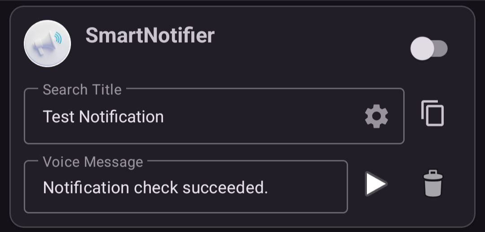

---  
title: Edit Rule  
layout: default  
---  
# 📝 Edit a Rule

Use this screen when you want to change the contents of a rule you created.  
  

## 🆎 Notification title condition

* Set part or all of the notification title you want to announce by voice.
* The rule uses partial matching for the configured word. For example, if you set "test" as the notification title condition, titles such as "**test** notification" and "notification **test**" will match.
* If this field is blank, the notification title is ignored and the voice announcement is played.
* You can register multiple word patterns, but each identical word can be registered only once.

  👉[Advanced condition settings](./setting_search_advanced.md)

> When there are multiple search words, the first pattern found by searching the words in ascending order is announced.  
> If the field is blank, the voice announcement is played when the search reaches the end of the pattern list.

## 🎤 Voice message

* Set the content of the voice announcement.
* If this field is blank, the app plays the default announcement: "A notification has arrived from <app name>."

## ✅ Enabled

* Enables or disables the voice announcement rule. For details, see [Enable the voice announcement rule](./getting_started#3%EF%B8%8F%E2%83%A3-enable-the-voice-announcement-rule).

##  Duplicate (copy)

* Adds a duplicate of the voice announcement rule.

> To avoid duplicating the notification title condition, a number is added to the end of the copied notification title condition.

## 🗑️ Delete

* Deletes the currently selected voice announcement rule.

## ▶️ Play voice announcement

* Reads the voice message aloud for confirmation.   

> [Back to the top page](./index)
