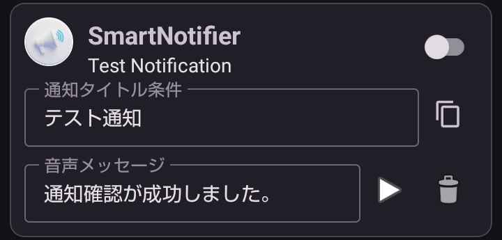

---  
title: Edit Rule  
layout: default  
---  
# 📝 ルールの編集

作成したルールの内容を変更したい場合に行います。  
  

## 🆎 通知タイトル条件

* 音声案内したい通知タイトルの一部または全部を設定します。
* 判定は設定したワードの部分一致で音声案内を行います。 例) 通知タイトル条件に「テスト」と設定すると、通知のタイトルが「**テスト**通知」、「通知**テスト**」の場合に音声案内の対象になります。
* 空欄にすると、通知タイトルは無視して音声案内を行います。
* 複数のワードパターンを登録できますが、同一ワードは一つだけです。

> 検索ワードが複数ある場合は、ワードを昇順に検索した最初のパターンを音声案内します。  
> 空欄の場合、パターンの最後まで到達したときに音声案内をします。

## 🎤 音声メッセージ

* 音声案内の内容を設定します。
* 空欄にすると、「＜アプリ名＞からの通知が届きました。」という定型案内をします。

## ✅ 有効

* 音声案内ルールを有効/無効にします。詳しくは[音声案内ルールを有効にする](https://teyandei.github.io/SmartNotifire-Rev2/ja/getting_started#2%E2%83%A3-%E9%9F%B3%E5%A3%B0%E6%A1%88%E5%86%85%E3%83%AB%E3%83%BC%E3%83%AB%E3%82%92%E6%9C%89%E5%8A%B9%E3%81%AB%E3%81%99%E3%82%8B)をご覧ください。

##  複製（コピー）

* 音声案内ルールの複製を追加します。

> 通知タイトル条件が重複しないように末尾に番号をつけた通知タイトル条件を設定します。

## 🗑️ 削除

* 現在選択している音声案内ルールを削除します。

## ▶️ 音声案内のプレイ

* 確認のために音声メッセージを読み上げます。   

> [先頭ページへ](./index)
