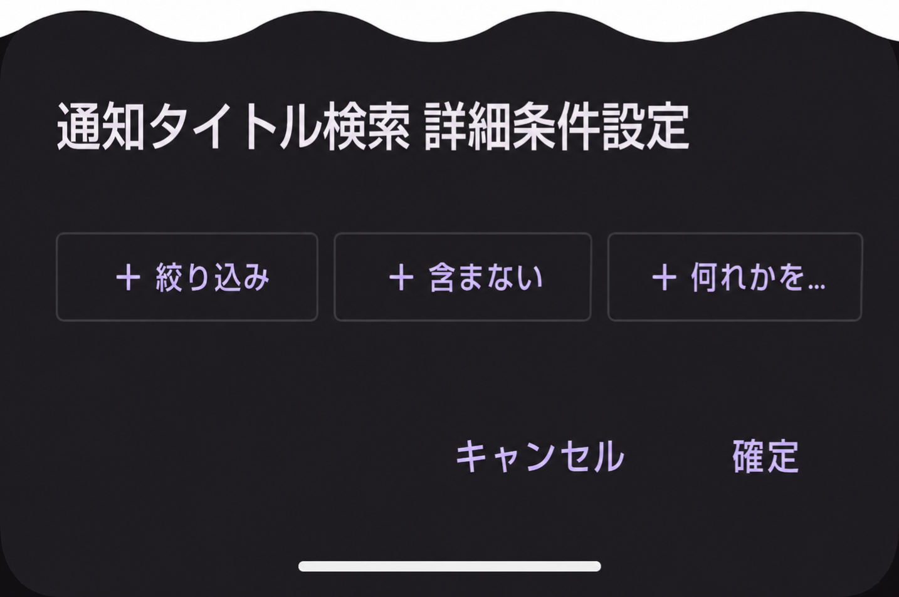
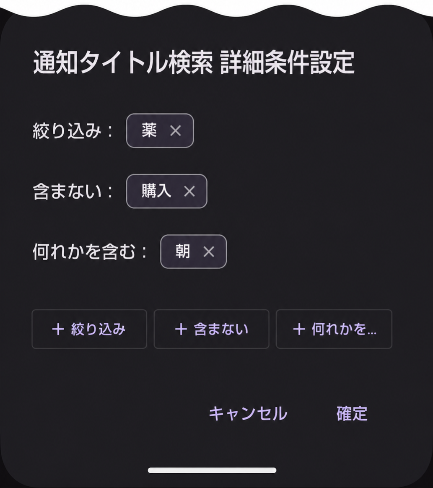
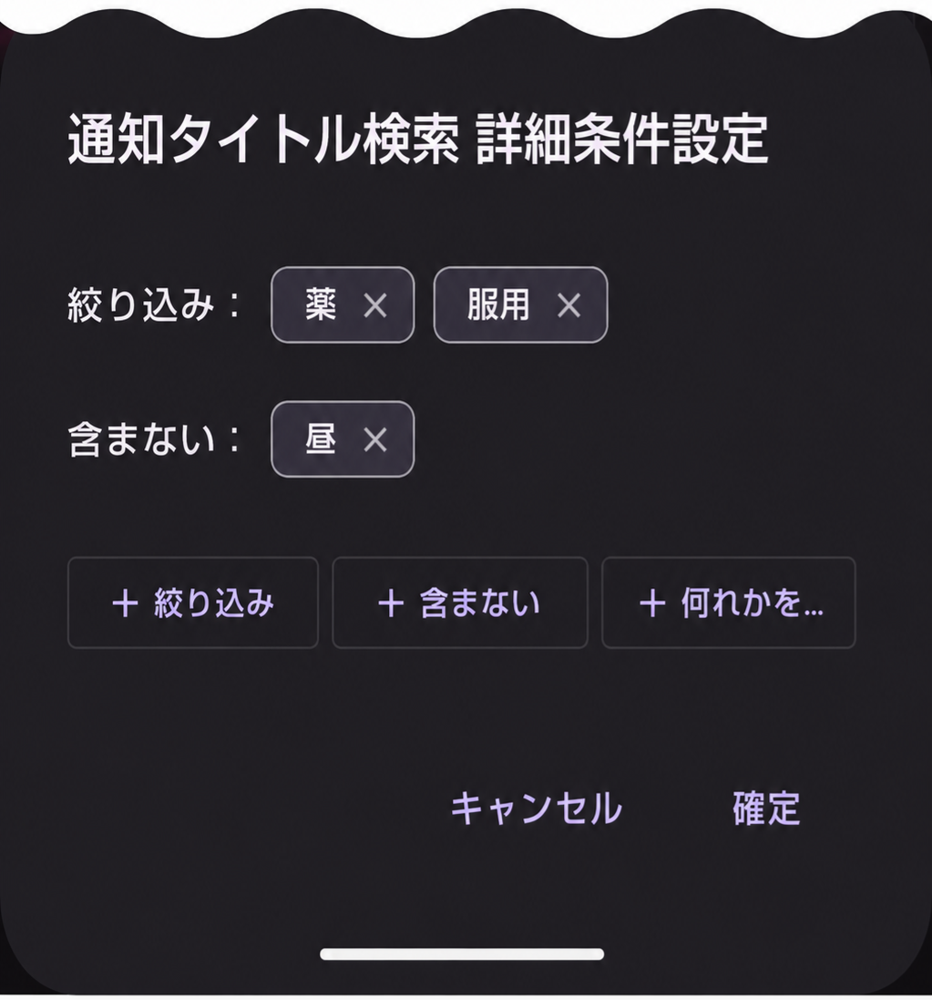

---  
title: 検索詳細設定  
layout: default  
---  
# 通知タイトル条件 詳細設定

詳細設定は、ワード単位に以下のカテゴリで検索条件を絞り込みます。

1. 絞り込み(AND条件)
2. 含まない(NOT条件)
3. 何れかを含む(OR条件)

3つのカテゴリの判定結果をすべて満たす通知が対象になります。

## 詳細設定をはじめる

通知タイトル検索の中にある歯車(⚙️)アイコンをタップします。  

## 詳細設定の表示

画面下部から通知タイトル条件 詳細条件設定を表示します。

## 詳細設定をする

「＋絞り込み」、「＋含まない」、「＋何れかを含む」の各ボタンをタップしてワードを追加して下さい。カテゴリ別にワードは一つ以上追加できます。

３つのボタンでそれぞれ１ワードを追加した画面は以下ようになります。

  

上図の判定は以下の３条件を全て満たすものが対象となります。

1. 「薬」が含まれている。
2. 「購入」が含まれていない。
3. 「朝」が含まれている。

## 詳細条件設定中のルール画面

通知タイトル検索画面は以下のような表示になります。

    

> 詳細条件設定中の音声案内ルールは複製（コピー）出来ません。

## 具体例

詳細設定が次の場合の具体例です。

    

この設定では、通知タイトルに「薬」と「服用」が含まれ、かつ「昼」が含まれないものが対象になります。

通知タイトル：
1. 薬の服用時間です。[朝] → ◎(有効)
2. 薬の服用時間です。[昼] → ✕(昼が入っているので無効)
3. 薬の服用時間です。[夕] → ◎(有効)
  
  ---

[ルールの編集](./edit_rule.md)へ  
[先頭ページ](./index.md)へ
