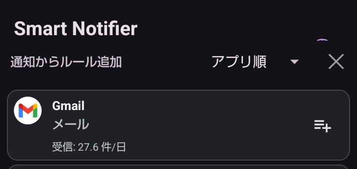
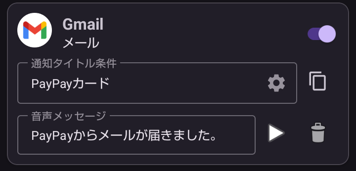
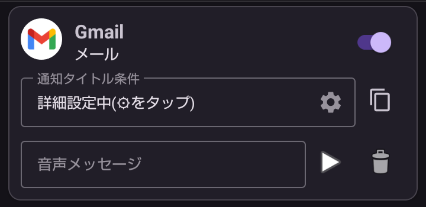

---  
title: Gmailの通知を音声案内  
layout: default  
---  
# 📧 Gmailの通知を音声案内

Gmailの通知で、チャンネル名が「メール」の通知には2種類の通知タイトルがあります。※1  

- 差出人 (PayPayカード, Amazon.co.jpなど)
- 新着メール数通知 (「2件の新着メール」といった件数が変わるもの)

> ※1 2026年5月現在のGmailの仕組みです。

これを利用して、  

- 特定差出人の音声案内をする。  
- 新着メール数通知を音声案内しないようにする。  

という2つの利用方法を紹介します。

## 🎯 ゴール１ 特定差出人からのメールを音声案内 

## PayPayカードからメールが届いたら、「PayPayからメールが届きました」と音声案内する。

## 🎯 ゴール２ 新着メール数通知を音声案内しないようにする 

## 特定差出人以外の差出人通知は「Gmailから通知が届きました」と音声案内し、新着メール数通知は音声案内しない。  

> 新着メール数通知は通知音だけが鳴り、音声案内はしません。

## 🌱 *STEP 1* Gmailの音声案内ルールを追加する。

1. ＋追加ボタンをタップしてGmailの通知を探します。

    

2.  をタップしてGmailのルールを追加します。

## 🌷 *STEP 2* 特定差出人の音声案内ルールを編集する  

- 下の画面のとおりに設定します。

    

## 🌻 *STEP 3* 新着メール数通知を除外する音声案内ルールを編集する  

1. 通知タイトル条件で空欄のものがあればそれを利用します。なければ複製()をタップして追加します。  
2. 歯車(⚙️)をタップします。  
3. 不要なチップを消して、新着メール数通知に含まれる「新着メール」を「含まない」条件に設定して「確定」します。  

      

4. 音声メッセージを空欄にします。空欄の場合は「Gmailから通知が届きました。」という定型案内になります。

      

以上で設定は終了です。📧

[先頭ページ](./index.md)へ
