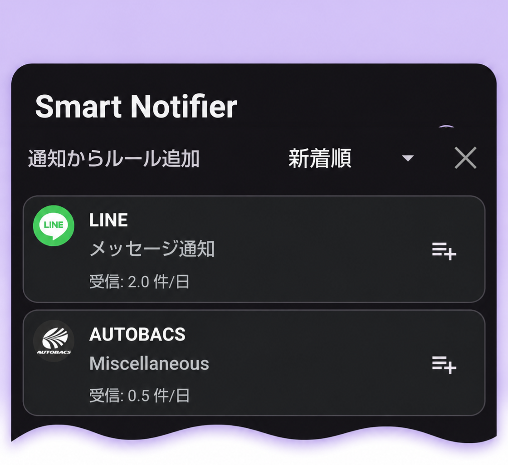
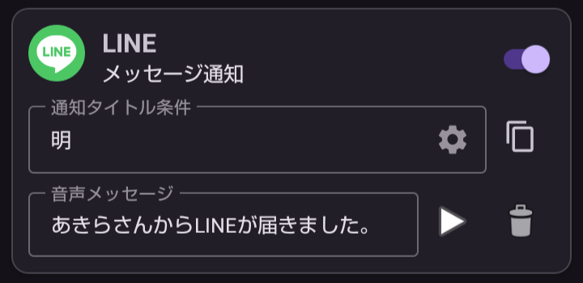

---  
title: LINEで友達からのメッセージを音声案内  
layout: default  
---  
# LINEで友達からのメッセージを音声案内

LINEのトークで友達からメッセージが届くと通知が送信されます。  
そのときの通知チャンネル名は**メッセージ通知**です。  
そして、通知タイトルは友達の名前※1となります。

> ※1 2026年5月現在のLINEの仕組みです。

これを利用して、**特定の友達からのメッセージ通知に音声案内**をつけてみましょう。  

## 🎯 ゴール 

友達の名前を「明」（あきら）さんとしましょう。

## 明さんからLINEのメッセージが届いたら、「明さんからLINEが届きました」と音声案内する。

## 🌱 *STEP 1* LINEの音声案内ルールを追加する。

1. ＋追加ボタンをタップしてLINEの通知を探します。

    

2.  をタップしてLINEのルールを追加します。

## 🌷 *STEP 2* 音声案内ルールを編集する  

- 下の画面のとおりに設定します。

    

    > ポイント1  
    > 友達に「明」を含む名前の人がいると、その人も音声案内します。  
    > 明さんだけが対象になるように、[詳細条件](./setting_search_advanced%20.md)(⚙️)で「明」さんだけに絞ることができます。(例：「正明」さんを含まないなど)
    
    > ポイント2  
    > 音声メッセージでは、名前をひらがなで「あきら」とします。  
    > デバイスによっては「明」は「めい」・「あき」と読むかもしれません。
  
以上で設定は終了です。友達からのLINEを待ちましょう📱

[先頭ページ](./index.md)へ
