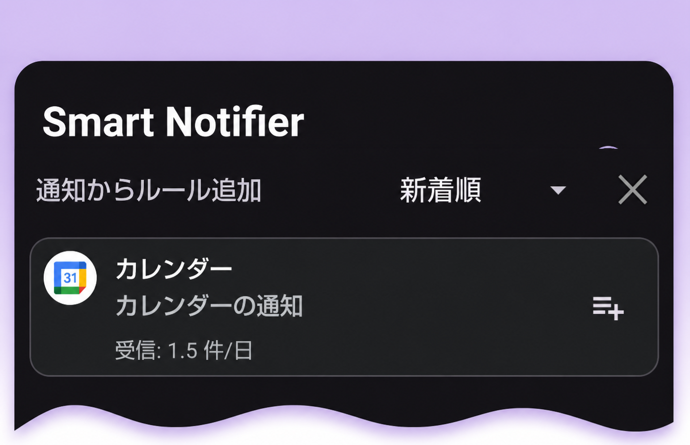
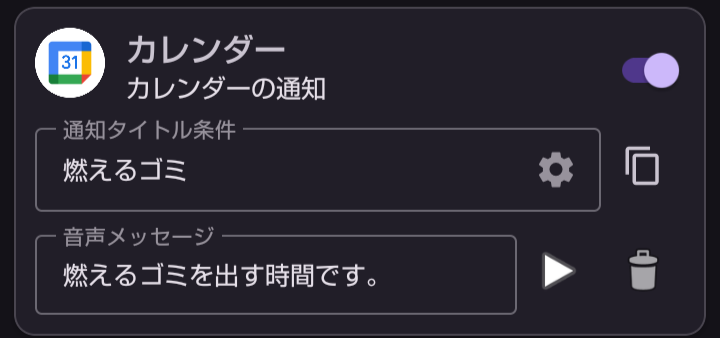

---  
title: 予定で作る定時タスクを音声案内  
layout: default  
---  

# 予定を使って、定時タスクを音声でお知らせ  

Googleカレンダーの**予定**は、デフォルトで30分前に通知を出します。  
このときのチャンネル名は**カレンダーの通知**です。  
そして、**通知タイトルは予定に設定したタイトル**になります。  
これを利用して、定時タスクを音声案内してみましょう。  

## 🎯 ゴール  

燃えるゴミが毎週月曜日、木曜日の朝8時半までに出す予定で当日の朝8時に、

## 毎週月曜日・木曜日の朝8時に、「燃えるゴミを出す時間です。」と音声案内をする。  

## 🌱 *STEP 1* カレンダーの音声案内ルールを追加する。  

1. カレンダーに予定を追加  
    Googleカレンダーに「タイトル；燃えるゴミ、開始時刻：8:30、繰り返し：毎週月・木、通知：30分前」という予定を作ります。

2. ＋追加ボタンをタップしてカレンダーの通知を探します。

      ]
      

    > カレンダーの通知が見つからない場合は、仮の予定を作って通知を行っておきます。  

## 🌷 *STEP 2* 音声案内ルールを編集する  

- 下の画面のとおりに設定します。

    

これで、毎週月曜日と木曜日の朝8時にスマホが教えてくれるので、ゴミを出しましょう。

[先頭ページ](./index.md)へ

