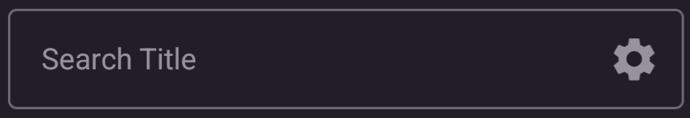
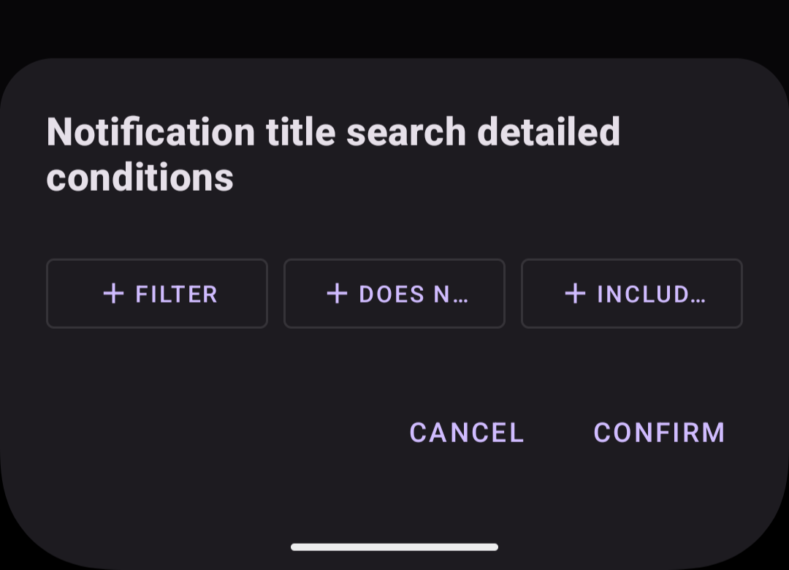
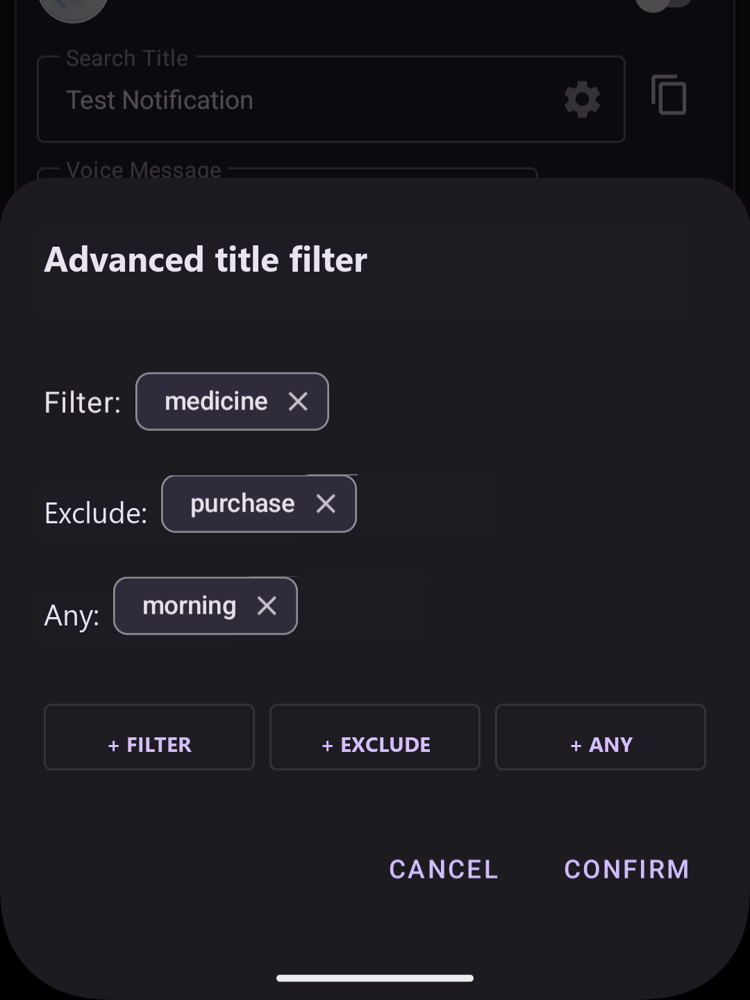
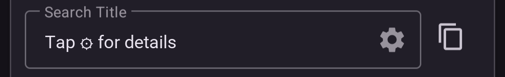
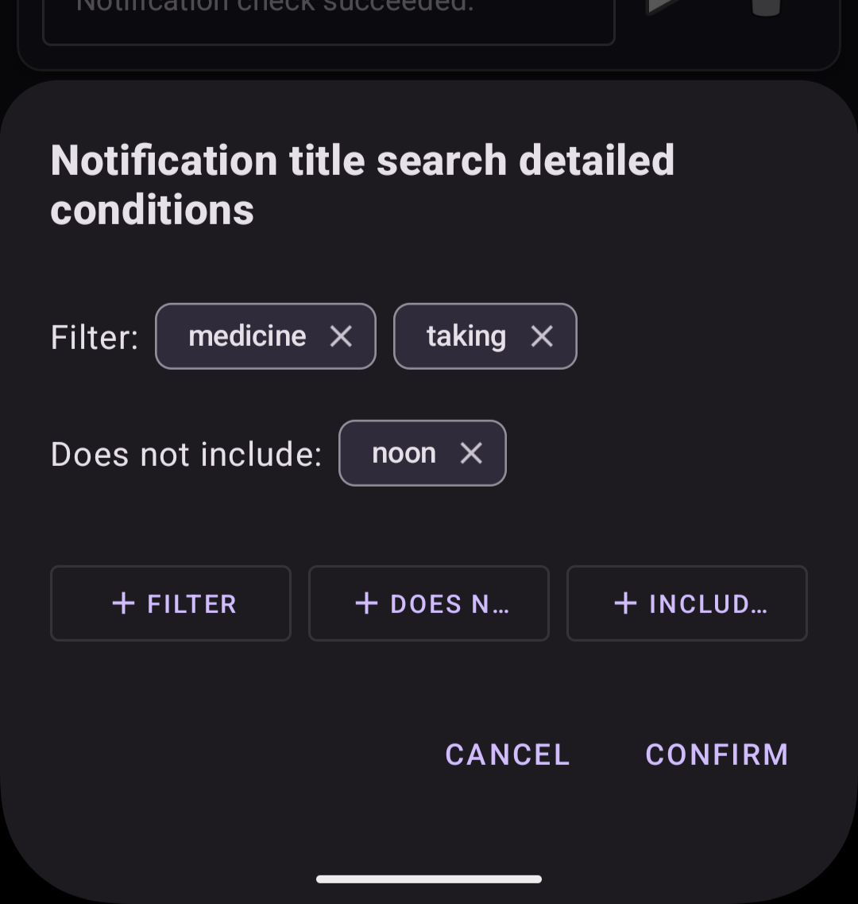

---  
title: Advanced Search Settings  
layout: default  
---  
# Advanced Title Filter

Advanced settings narrow down search conditions by word using the following categories.

1. Filter (AND condition)
2. Exclude (NOT condition)
3. Any (OR condition)

Notifications that satisfy all three category results are matched.

## Start advanced settings

Tap the gear (⚙️) icon in the notification title search field.  

## Advanced settings display

The advanced title filter is displayed from the bottom of the screen.

## Configure advanced settings

Tap each button, "+ Filter", "+ Exclude", or "+ Any", to add words. You can add one or more words for each category.

The following screen shows one word added with each of the three buttons.

  

The example above matches notifications that satisfy all three conditions below.

1. Contains "medicine".
2. Does not contain "purchase".
3. Contains "morning".

## Rule screen with advanced settings

The notification title search screen is displayed as follows.

    

> Voice announcement rules using advanced condition settings cannot be duplicated (copied).

## Example

The following is an example of advanced settings.

    

With this setting, notifications are matched when the notification title contains "medicine" and "taking", and does not contain "noon".

Notification titles:
1. It is time to take your medicine. [morning] → ◎ (matched)
2. It is time to take your medicine. [noon] → ✕ (not matched because it contains "noon")
3. It is time to take your medicine. [evening] → ◎ (matched)
  
  ---

[Edit a rule](./edit_rule.md)  
[Back to the top page](./index.md)
